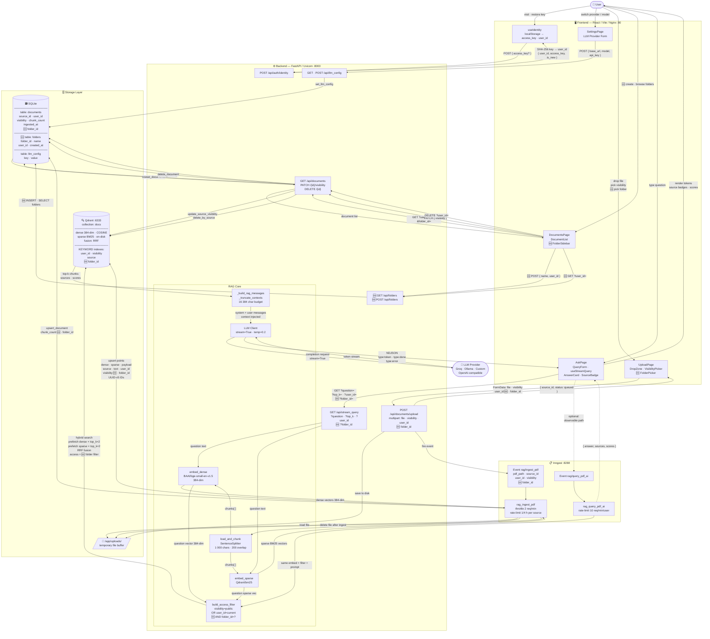

# Data Flow Diagram — RAG Monorepo

> Covers: ingestion, query/RAG, document management, auth, LLM config, and the proposed **folder classification** feature (`🆕`).

---

## 🆕 Folder Classification — Schema Delta

### What changes in each layer

| Layer | Change |
|-------|--------|
| **SQLite** | New `folders` table: `folder_id TEXT PK · name TEXT · user_id TEXT · created_at TEXT`. Add `folder_id TEXT` FK column to `documents` table. |
| **Qdrant** | Add `folder_id` to point payload. Add a KEYWORD index on `folder_id`. |
| **`build_access_filter()`** | Accept optional `folder_id`; append `FieldCondition(key="folder_id", match=MatchValue(value=folder_id))` as a `must` clause. |
| **Ingest event** | Add `folder_id` field to the Inngest event payload. |
| **`POST /api/documents/upload`** | Accept optional `folder_id` in the form data. |
| **`GET /api/documents`** | Accept optional `?folder_id=` query param. |
| **`GET /api/stream_query`** | Accept optional `?folder_id=` query param; pass to `build_access_filter`. |
| **Frontend** | `FolderPicker` on upload; `FolderSidebar` on DocumentsPage to filter the list; folder selector on AskPage to scope the search. |

### Folder visibility rule
A folder inherits the visibility of its documents — there is no separate folder-level visibility flag. A user sees a folder if they own at least one document in it or if any document in it is public.
